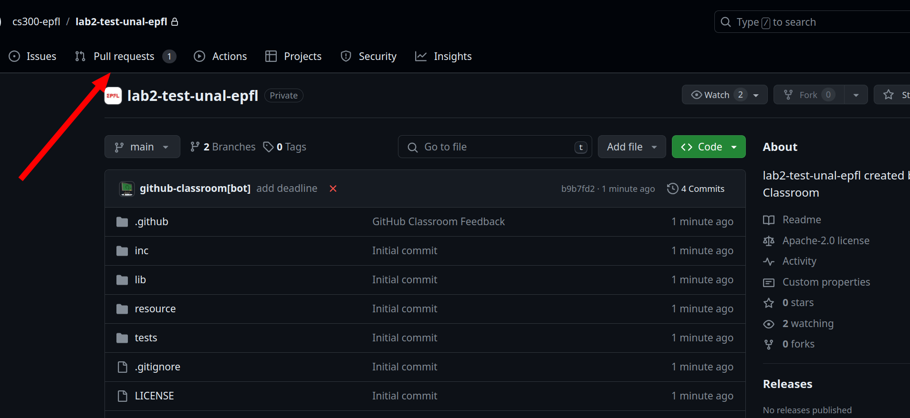

# Lab environment

Follow the steps in the [README](vm_setup.md) to setup the VM.
All the tools required for this course are already setup inside the VM.

You can follow the steps here to setup VSCode and run the code inside the VM: [VSCode setup](vscode_setup.md).

# GitHub Classroom

We use GitHub Classroom for lab submission and automatic grading and evaluation.
The process to set up for the GitHub classroom is as follows.

1. Use the invite link for each sent to you to join the classroom and
   assignment.
2. Link your GitHub account with your respective Moodle username.
3. Clone the repository and begin working on it.

Below is a step by step illustration on getting started.

1. Open [GitHub Classroom](https://classroom.github.com) and click on the CS 300 Labs
   classroom.

1. Accept the Lab 2 assignment.

2. Wait for the assignment to be setup and keep refreshing the page.

3. Clone the repository listed. You can also directly open this in Visual Studio
   Code, and install the GitHub Classroom extension.

4. Go to the Pull Requests tab.

5. Open the Feedback Pull Request. This PR should **NOT** be closed by you, and
   contains all the evaluation and grading details for your lab.

6. Whenever you commited a change the CI will going to run (See orange indicator). To see the CI result enter the feedback pull request.
 

  
7.  In the CI status, click on details to view the output of your assignment submission.

Depending on your submission, you will be awarded points. In the screenshots below, we have examples of two cases, where the student fails some tests, and passes all tests. (If you can not see any score it's possibly due to too many test cases which has failed. To see that go to "View Raw Logs" under the Gear icon at the top right of the page.)

On passing everything,you see this.

